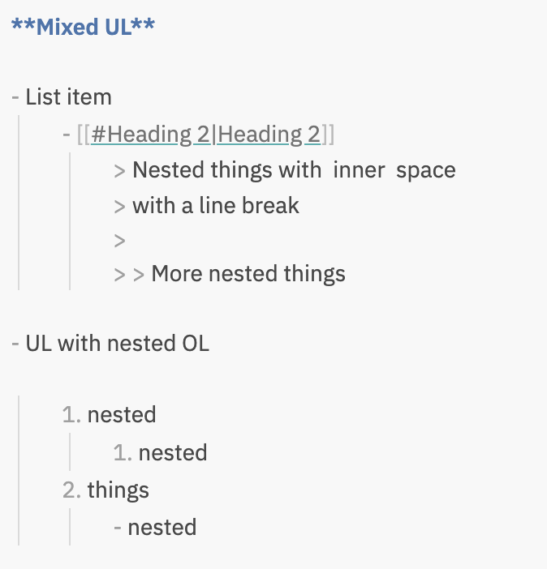
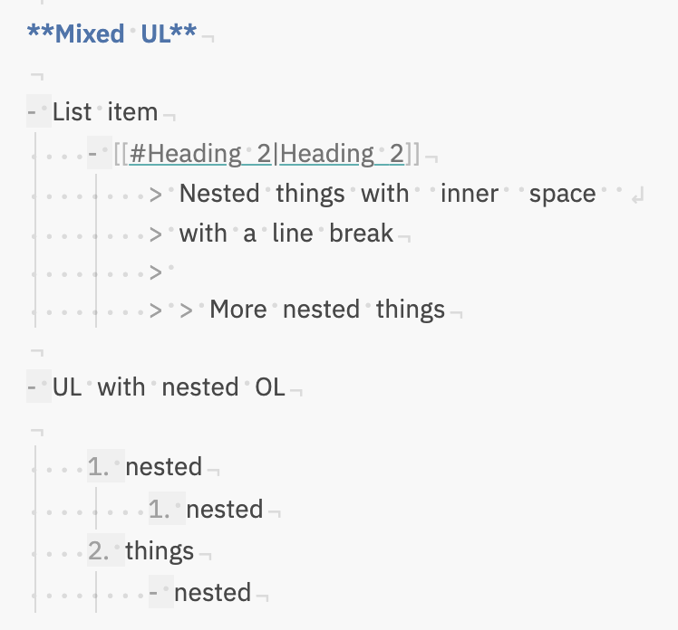
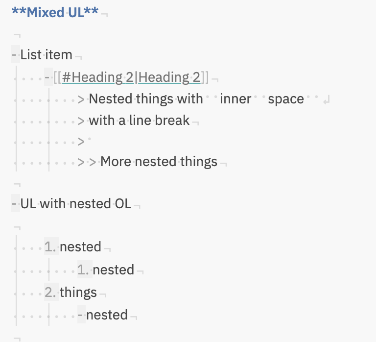
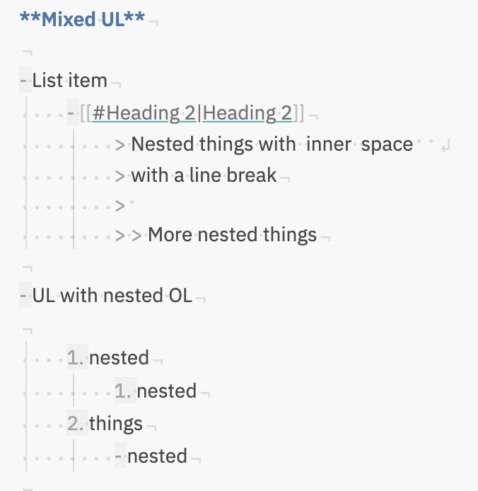

# Obsidian: 显示空白字符

[](https://github.com/ebullient/obsidian-show-whitespace-cm6/releases)  [![CC BY-SA 4.0][cc-by-sa-shield]][cc-by-sa]

这是一个简单的插件，用于在源码模式和实时阅览模式下启用 CodeMirror 6 扩展以突出显示空白字符。

> 译者：[jerrychan7@github](https://github.com/jerrychan7)

## 功能

- **空白字符可视化：** 显示笔记中的前导和尾随空白字符。
- **引用标志辨别：** 高亮显示引用的前导符号，使其易于区分。
- **列表标记空白：** 为列表标记（项目符号或数字）添加轻微的背景样式。

插件提供的基本 CSS 样式会在行首和行尾显示空白字符（不包括中间的空白字符），以提高可读性。

## 外观/感觉选项

插件提供了一些选项来自定义空白字符的外观和感觉。

您也可以完全禁用插件的 CSS 并使用自己的样式。

1. 使用插件设置禁用 style.css 的注册（这相当于样式设置插件的功能）
2. 将插件的 `style.css` 复制到您自己的 CSS 代码片段文件夹中
3. 根据需要更新样式。

### 示例

启用后，插件始终显示前导空白字符（因为这是最难看到的）。内部/尾随空白字符的显示取决于配置。

- 插件禁用：  
  

- 显示所有空白字符（优先于其他设置）、大纲列表标记：  
  

- 显示连续空白字符、大纲列表标记：  
  

- 大纲列表标记：  
  

### 行尾

在 CSS 代码片段中重新定义 `--line-end` 或 `--line-break` 以更改这些字符的显示方式。

```css
body {
  --line-end: '¬';
  --line-break: '↲';
}
```

## 安装

安装步骤：

1. 打开 `设置` -> `第三方插件`。
2. 关闭安全模式
3. 社区插件市场中 **浏览** 并搜索 "Show Whitespace"
4. 点击安装
5. 安装完成后点击启用，或者在 `设置` -> `第三方插件` -> `已安装插件` 列表中启用插件。

### 使用 Beta Reviewers Auto-update Tester (BRAT) 预览

1. **安装 BRAT：**

   - 打开 `设置` -> `第三方插件`。
   - 关闭安全模式。
   - 社区插件市场中点击 *浏览* 并搜索“BRAT”。
   - 安装最新版本的 **Obsidian 42 - BRAT**。

2. **配置 BRAT：**

   - 打开 BRAT 设置（`设置` -> `Obsidian 42 - BRAT`）。
   - 在 `Beta Plugin List` 部分，点击 `Add Beta Plugin`。
   - 指定此仓库：`ebullient/obsidian-show-whitespace-cm6`。

3. **启用插件：**

   - 导航到 `设置` -> `第三方插件`。
   - 启用插件。

## 对开发者

欢迎并感谢提交 Pull Request。😀

## 支持

有兴趣支持进一步开发吗？请考虑请我喝杯咖啡！

[](https://www.buymeacoffee.com/ebullient)

## 归属

虽然这是一个针对 CM6 的新实现，但样式和字符灵感来自 VSCode 的行为和 [death_au](https://github.com/deathau) 的原始 [Show Whitespace](https://github.com/deathau/cm-show-whitespace-obsidian) 插件。

## 许可证

本作品采用 [知识共享署名-相同方式共享 4.0 国际许可协议][cc-by-sa] 进行许可。

[][cc-by-sa]

[cc-by-sa]: http://creativecommons.org/licenses/by-sa/4.0/
[cc-by-sa-image]: https://licensebuttons.net/l/by-sa/4.0/88x31.png
[cc-by-sa-shield]: https://img.shields.io/badge/License-CC%20BY--SA%204.0-lightgrey.svg
