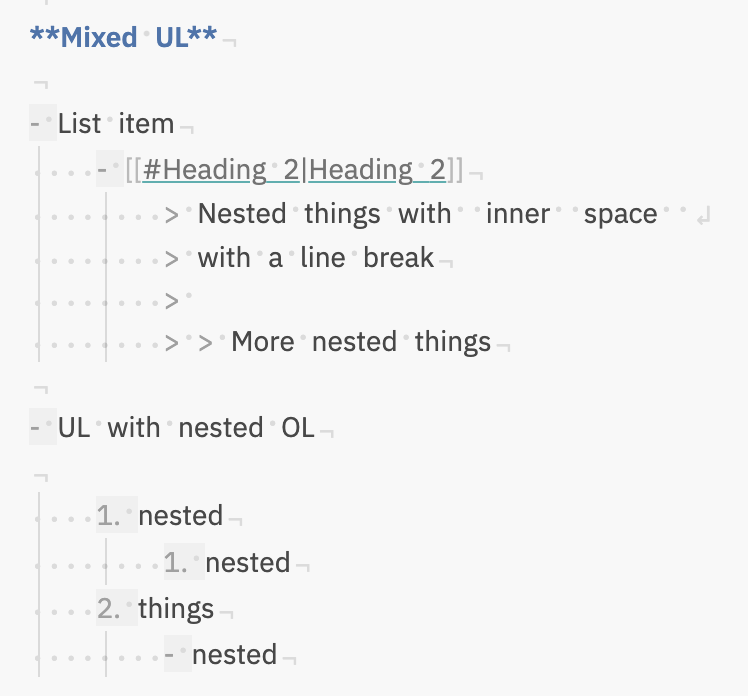
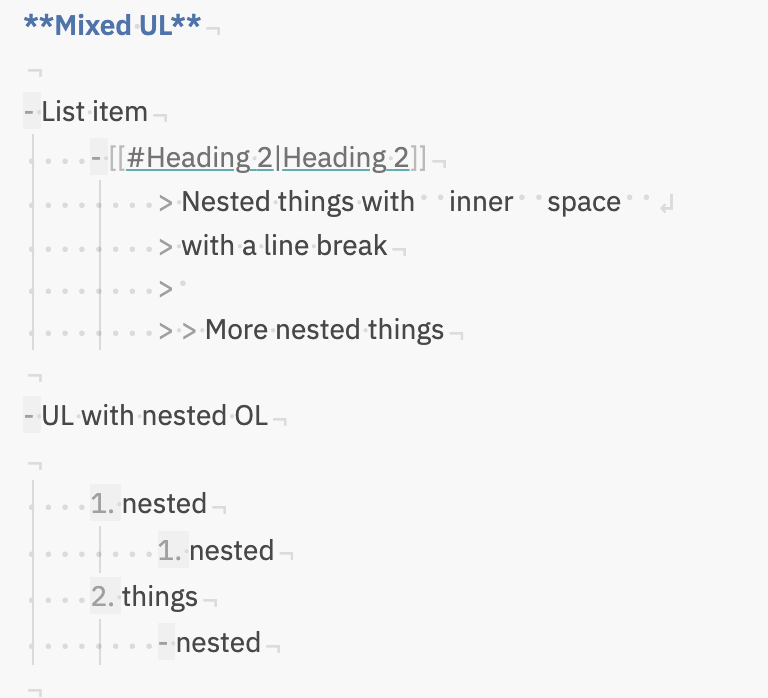

# Obsidian: 顯示空白字元

[](https://github.com/ebullient/obsidian-show-whitespace-cm6/releases)  [![CC BY-SA 4.0][cc-by-sa-shield]][cc-by-sa]

這是一個簡單的外掛，可啟用 CodeMirror 6 擴展功能以突出顯示原始碼模式和實際預覽模式中的空白字元。

> 譯者：[jerrychan7@github](https://github.com/jerrychan7)

## 特徵

- **空白字元視覺化：** 顯示筆記中的前導和尾隨空白字元。
- **區塊引言識別：** 高亮顯示引用的前導符號，使其易於區分。
- **清單標記空白：** 為有序和無序清單的標記（項目符號或數字）添加輕微的背景樣式。

外掛提供的基本 CSS 樣式會在行首和行尾（而不是中間）呈現空白字元，以提高可讀性。

## 外觀/感覺選項

外掛提供了一些選項來自訂空白字元的外觀和感覺。

您也可以完全禁用外掛的 CSS 並使用您自己的樣式。

1. 使用外掛設置禁用 style.css 的註冊（這於樣式設置外掛的功能相同）
2. 將外掛程式的 `style.css` 複製到您自己的 CSS snippets 片段資料夾中
3. 根據需要更新樣式。

### 範例

啟用後，外掛始終顯示前導空白字元（因為這是最難看到的）。內部/尾隨空白字元的顯示取決於配置。

- 外掛程式停用時：  
  

- 顯示所有空白字元（優先於其他設定）、大綱清單標記：  
  

- 顯示連續空白字元、大綱清單標記：  
  

- 大綱清單標記：  
  

### 行尾

在 CSS 片段中重新定義 `--line-end` 或 `--line-break` 以變更這些字元的顯示方式。

```css
body {
  --line-end: '¬';
  --line-break: '↲';
}
```

## 安裝

安裝步驟：

1. 打開 `設置` -> `第三方外掛程式`
2. 啟用社群外掛程式
3. 在社群外掛程式中 **瀏覽** 並搜尋 "Show Whitespace"
4. 點擊安裝
5. 安裝完成后點擊啓用，或者在 `設置` -> `第三方外挂程式` -> `已安裝外挂程式` 列表中啓用。

### 使用 Beta Reviewers Auto-update Tester (BRAT) 預覽

1. **安裝 BRAT**：

   - 打開 `設置` -> `第三方外掛程式`。
   - 啟用社群外掛程式。
   - 在社群外掛程式中 *瀏覽* 並搜尋“BRAT”。
   - 安裝最新版本的 **Obsidian 42 - BRAT**。

2. **配置 BRAT**：

   - 打開 BRAT 設置（`設置` -> `Obsidian 42 - BRAT`）。
   - 在 `Beta Plugin List` 部分，點擊 `Add Beta Plugin`。
   - 指定此儲存庫：`ebullient/obsidian-show-whitespace-cm6`。

3. **啟用外掛**：

   - 導航至 `設置` -> `第三方外掛程式`。
   - 啟用外掛。

## 對於開發者

歡迎並感謝提交 Pull Request。😀

## 支援

有興趣支持進一步開發嗎？考慮給我買杯咖啡吧！

[](https://www.buymeacoffee.com/ebullient)

## 歸屬

雖然這是針對 CM6 的新實現，但樣式和字元的靈感來自 VSCode 的行為和 [death_au](https://github.com/deathau) 的原始 [Show Whitespace](https://github.com/deathau/cm-show-whitespace-obsidian) 外掛程式。

## 執照

本作品採用 [創用 CC 姓名標示-相同方式分享 4.0 國際 授權條款][cc-by-sa] 進行授權。

[][cc-by-sa]

[cc-by-sa]: http://creativecommons.org/licenses/by-sa/4.0/
[cc-by-sa-image]: https://licensebuttons.net/l/by-sa/4.0/88x31.png
[cc-by-sa-shield]: https://img.shields.io/badge/License-CC%20BY--SA%204.0-lightgrey.svg
