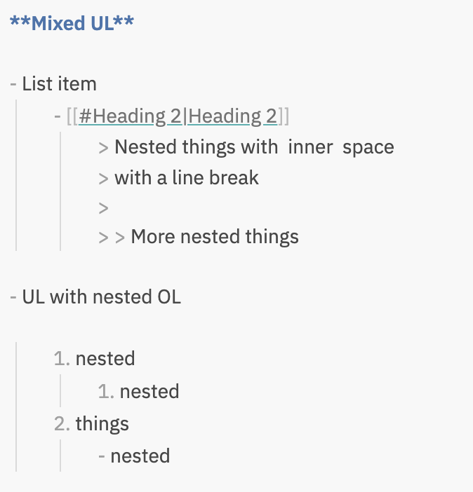
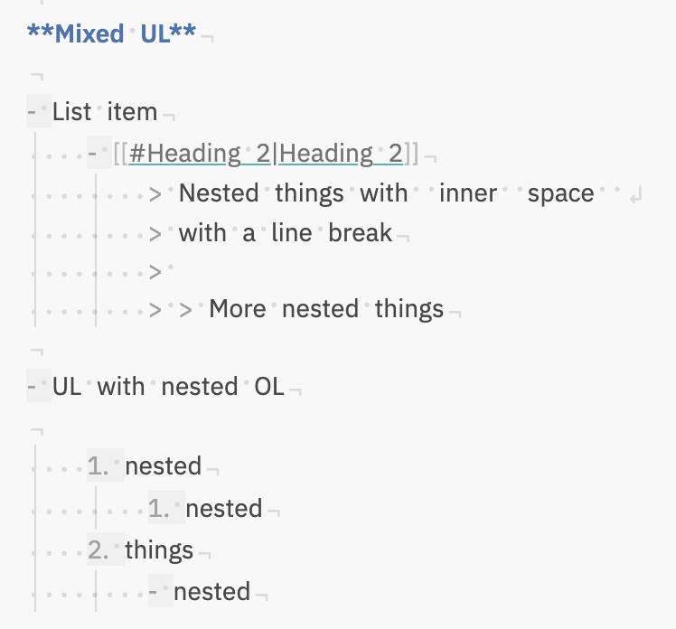
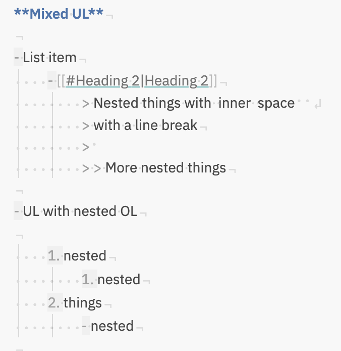

# Obsidian: Show Whitespace

[](https://github.com/ebullient/obsidian-show-whitespace-cm6/releases)  [![AGPL-3.0][agpl-shield]][agpl]

This plugin uses CodeMirror 6 extensions to visualize whitespace in both Source and Live Preview modes.

## Features

Each feature has its own independent toggle in settings. All markers hide while you are actively typing and reappear one second after the last keystroke.

- **Line endings (¬):** Appends a pilcrow character at the end of every line (suppressed on the cursor line).
- **Hard line breaks (↲):** Marks lines ending in two or more spaces — the Markdown hard line break syntax (suppressed on the cursor line).
- **Trailing spaces:** Highlights stray spaces or tabs at the end of lines with dot markers.
- **Double spaces:** Highlights two or more consecutive spaces within a line.
- **Blockquote markers:** Always shows the leading `>` for blockquotes in Live Preview mode.
- **List marker outline:** Applies a subtle background to the space reserved by list markers.
- **Space dot contexts:** Shows a dot per space character selectively in frontmatter, tables, code blocks, or everywhere.

## Look / Feel options

The plugin provides a few options to customize the look and feel of whitespace characters.

You can also completely disable the plugin's CSS and use your own.

1. Use the plugin setting to disable registration of style.css (this functions as a style settings plugin would)
2. Copy the plugin `style.css` into your own CSS snippet
3. Update styles as desired.

### Examples

Once enabled, the plugin always shows leading space (as that is the hardest to see).
Display of inner/trailing spaces depends on configuration.

- Plugin disabled:  
    

- Show all whitespace; outline list markers:  
    

- Leading/Trailng whitespace; outline list markers:  
    

### Line endings

Redefine `--line-end` or `--hard-break` to change how those characters appear in a CSS snippet.

```css
body {
  --line-end: '¬';
  --hard-break: '↲';
}
```

## Installation

To install:

1. Open `Settings` -> `Community Plugins`
2. Disable safe mode
3. **Browse** and search for "Show Whitespace"
4. Click install
5. Use the toggle on the community plugins tab to enable the plugin.

### Preview with Beta Reviewers Auto-update Tester (BRAT)

1. **Install BRAT**:
    - Open `Settings` -> `Community Plugins`.
    - Disable safe mode.
    - *Browse*, and search for "BRAT."
    - Install the latest version of **Obsidian 42 - BRAT**.
2. **Configure BRAT**:
    - Open BRAT settings (`Settings` -> `Obsidian 42 - BRAT`).
    - In the `Beta Plugin List` section, click `Add Beta Plugin`.
    - Specify this repository: `ebullient/obsidian-show-whitespace-cm6`.
3. **Enable the Plugin**:
    - Navigate to `Settings` -> `Community Plugins`.
    - Enable the plugin.

## For developers

Pull requests are both welcome and appreciated. 😀

## Support

Interested in supporting further development? Consider buying me a coffee!

[](https://www.buymeacoffee.com/ebullient)

## Attribution

While this is a new implementation for CM6, styles and characters are inspired by behavior in VSCode and the original [Show Whitespace](https://github.com/deathau/cm-show-whitespace-obsidian) plugin by [death_au](https://github.com/deathau).

## License

This work is licensed under the [GNU Affero General Public License v3.0][agpl].

[agpl]: https://www.gnu.org/licenses/agpl-3.0.en.html
[agpl-shield]: https://img.shields.io/badge/License-AGPL%20v3-blue.svg
